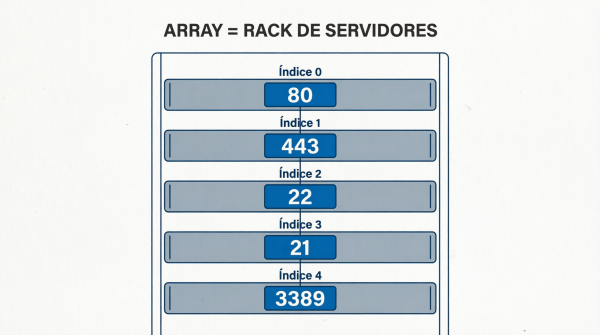

-orange?style=for-the-badge)


## Arrays

---

## Objetivos

1. Comprender qué es un array y para qué sirve
2. Declarar, inicializar y acceder a elementos de un array
3. Recorrer arrays con bucles `for`
4. Aplicar arrays a contextos reales de ASIR (redes, sistemas, hardware)
5. Realizar operaciones básicas: búsqueda, máximo/mínimo, conteo

---

## 1. Declaración y acceso básico

### ¿Qué es un Array?  

Un array es como un rack de servidores:
- tiene un número fijo de ranuras
- cada una tiene un número (índice)
- solo puedes guardar un tipo de cosa en cada ranura
- Si intentas acceder a una ranura que no existe, el rack te da error
  

  


```java
public class ArrayComoRack {
    public static void main(String[] args) {
        
        // El rack tiene 5 ranuras para servidores
        int[] rackServidores = {80, 443, 22, 21, 3389};
        
        // ¿Cuántas ranuras tiene el rack?
        System.out.println("Ranuras totales: " + rackServidores.length);
        
        // Acceder a una ranura específica
        System.out.println("Ranura 0 (HTTP): " + rackServidores[0]);
        System.out.println("Ranura 1 (HTTPS): " + rackServidores[1]);
        
        // Intentar acceder a una ranura que NO existe → ERROR
        // System.out.println(rackServidores[5]); // ❌ ArrayIndexOutOfBoundsException!
        
        // Recorrer todas las ranuras del rack
        System.out.println("\n=== INVENTARIO DEL RACK ===");
        for (int ranura = 0; ranura < rackServidores.length; ranura++) {
            System.out.println("Ranura " + ranura + ": Puerto " + rackServidores[ranura]);
        }
    }
}
``` 

### Otro ejemplo:

```java
public class Ejemplo1_ArrayBasico {
    public static void main(String[] args) {
        
        // Declaración e inicialización de un array de puertos
        int[] puertos = {80, 443, 22, 21, 3389};
        
        // Acceder a elementos individuales (índice empieza en 0)
        System.out.println("Puerto HTTP: " + puertos[0]);      // 80
        System.out.println("Puerto HTTPS: " + puertos[1]);     // 443
        System.out.println("Puerto SSH: " + puertos[2]);       // 22
        
        // Saber cuántos elementos tiene el array
        System.out.println("Total de puertos: " + puertos.length);
        
        // Modificar un valor
        puertos[3] = 25;  // Cambiamos FTP (21) por SMTP (25)
        System.out.println("Nuevo puerto 4: " + puertos[3]);
    }
}
```

## Ejercicio 1: Mis IPs del Laboratorio  

Crea un array con 5 direcciones IP de tu laboratorio (ej: "192.168.1.10") y muestra por pantalla:  
- La primera IP
- La última IP
- El total de IPs almacenadas

```java
  public class Ejercicio1_MisIPs {
    public static void main(String[] args) {
        
        // TU CÓDIGO AQUÍ
        String[] ips = {"192.168.1.10", "192.168.1.11", "192.168.1.12", 
                        "192.168.1.13", "192.168.1.14"};
        
        System.out.println("Primera IP: " + ips[0]);
        System.out.println("Última IP: " + ips[ips.length - 1]);
        System.out.println("Total de IPs: " + ips.length);
    }
}
```

## Ejercicio 2: Recorrer un array con bucle ```for```  

```java
public class Ejemplo2_RecorrerArray {
    public static void main(String[] args) {
        
        // Array de nombres de servidores
        String[] servidores = {"SRV-WEB", "SRV-DB", "SRV-MAIL", "SRV-DNS", "SRV-FILE"};
        
        System.out.println("=== LISTADO DE SERVIDORES ===");
        
        // Recorrer todo el array
        for (int i = 0; i < servidores.length; i++) {
            System.out.println("Servidor " + (i + 1) + ": " + servidores[i]);
        }
        
        // Recorrer solo los primeros 3
        System.out.println("\n=== SERVIDORES CRÍTICOS (primeros 3) ===");
        for (int i = 0; i < 3; i++) {
            System.out.println(servidores[i]);
        }
    }
}

```


## Ejercicio 3: Estado de equipos en red  

Crea dos arrays paralelos: uno con nombres de equipos y otro con su estado (true = online, false = offline). Recórrelos y muestra solo los equipos que están online.  

```java
public class Ejercicio2_EquiposRed {
    public static void main(String[] args) {
        
        String[] equipos = {"PC-01", "PC-02", "PC-03", "PC-04", "PC-05"};
        boolean[] estado = {true, false, true, true, false};
        
        System.out.println("=== EQUIPOS ONLINE ===");
        
        // TU CÓDIGO AQUÍ
        for (int i = 0; i < equipos.length; i++) {
            if (estado[i] == true) {
                System.out.println(equipos[i] + " - ONLINE");
            }
        }
    }
}
```

## Ejercicio 4: Buscar un elemento en un array (Búsqueda lineal)  

Recorremos el array comparando cada elemento hasta encontrar lo que buscamos.  

```java
public class Ejemplo3_BuscarElemento {
    public static void main(String[] args) {
        
        // Array de puertos abiertos en un firewall
        int[] puertosAbiertos = {80, 443, 22, 8080, 3306, 5432};
        int puertoBuscar = 3306;
        boolean encontrado = false;
        
        // Búsqueda lineal
        for (int i = 0; i < puertosAbiertos.length; i++) {
            if (puertosAbiertos[i] == puertoBuscar) {
                encontrado = true;
                System.out.println("✅ Puerto " + puertoBuscar + " encontrado en posición: " + i);
                break;  // Salimos del bucle cuando encontramos
            }
        }
        
        if (!encontrado) {
            System.out.println("❌ Puerto " + puertoBuscar + " NO está abierto");
        }
    }
}

```

## Ejercicio 5: Validar usuario en lista de administradores

Crea un array con nombres de usuarios administradores. Pide al usuario que introduzca un nombre (usando Scanner) y busca si está en la lista.

```java
import java.util.Scanner;

public class Ejercicio3_ValidarAdmin {
    public static void main(String[] args) {
        
        String[] administradores = {"root", "admin", "sysadmin", "netadmin", "dbadmin"};
        Scanner sc = new Scanner(System.in);
        
        System.out.print("Introduce nombre de usuario: ");
        String usuario = sc.nextLine();
        
        boolean esAdmin = false;
        
        // TU CÓDIGO AQUÍ
        for (int i = 0; i < administradores.length; i++) {
            if (administradores[i].equals(usuario)) {
                esAdmin = true;
                break;
            }
        }
        
        if (esAdmin) {
            System.out.println("✅ Usuario con privilegios de administrador");
        } else {
            System.out.println("❌ Usuario NO tiene privilegios de administrador");
        }
        
        sc.close();
    }
}

```

## Ejercicio 6: Máximo y mínimo en un array  
Guardamos el primer valor como referencia y lo comparamos con el resto.  

```java
public class Ejemplo4_MaxMin {
    public static void main(String[] args) {
        
        // Temperaturas de CPU en grados (últimas 8 horas)
        int[] temperaturas = {45, 52, 48, 67, 71, 55, 49, 53};
        
        // Inicializamos max y min con el primer elemento
        int max = temperaturas[0];
        int min = temperaturas[0];
        int suma = 0;
        
        for (int i = 0; i < temperaturas.length; i++) {
            // Buscar máximo
            if (temperaturas[i] > max) {
                max = temperaturas[i];
            }
            // Buscar mínimo
            if (temperaturas[i] < min) {
                min = temperaturas[i];
            }
            // Sumar para media
            suma += temperaturas[i];
        }
        
        double media = (double) suma / temperaturas.length;
        
        System.out.println("=== MONITORIZACIÓN CPU ===");
        System.out.println("Temperatura Máxima: " + max + "°C");
        System.out.println("Temperatura Mínima: " + min + "°C");
        System.out.println("Temperatura Media: " + media + "°C");
    }
}

``` 

## Recursos de apoyo  

- Documentación oficial Oracle: https://docs.oracle.com/javase/tutorial/java/nutsandbolts/arrays.html
- Visualizador de código: https://www.onlinegdb.com/online_java_compiler
- Diagramas de arrays: https://www.visualgo.net/en/array

---  

