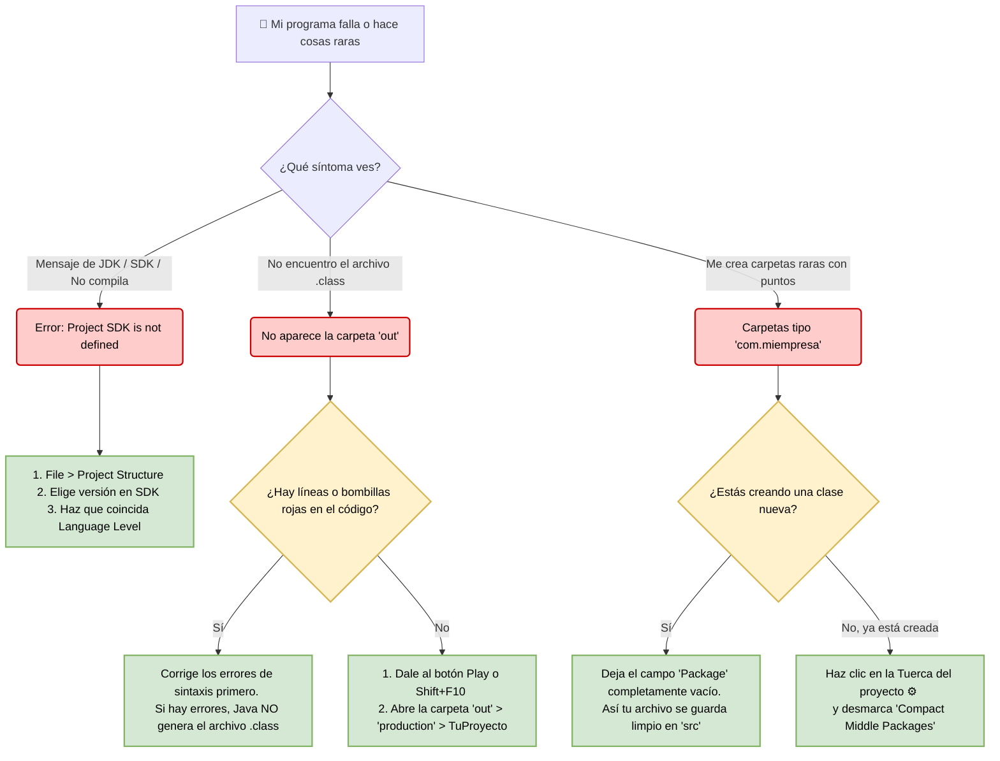

---

## Errores típicos y preguntas frecuentes (Intelli J Idea)  

Es completamente normal que al principio te líes con los archivos, las carpetas y los errores del sistema. Aquí tienes las respuestas a los dolores de cabeza más comunes de la clase:

### Error 1: "Me dice algo del JDK / SDK y no compila"
**¿Por qué pasa?** 
IntelliJ IDEA es solo la interfaz visual (un coche muy bonito), pero el **JDK (Java Development Kit)** es el motor que hace que el código funcione. Si no los conectas, el programa no arranca.

**Cómo solucionarlo:**
1. Ve al menú superior: `File` > `Project Structure...` > `Project`.
2. Busca la opción **SDK** y asegúrate de que no diga "No SDK". Selecciona la versión de Java de la clase (por ejemplo, 17 o 21).
3. Justo debajo, busca **Language Level** y asegúrate de que coincida con la misma versión del SDK. 
4. Haz clic en **Apply** y luego en **OK**.

---

### Error 2: "No encuentro el archivo `.class` por ningún lado"
**¿Por qué pasa?**
Tú escribes en un archivo `.java`, pero la computadora solo entiende archivos `.class` (el código traducido o compilado). Si tu código tiene un solo error (una línea roja), IntelliJ **frenará la traducción** y el archivo `.class` nunca se creará.

**Cómo solucionarlo:**
1. Revisa que no tengas ninguna bombilla roja ni líneas subrayadas en rojo en tu código.
2. Dale al botón de **Ejecutar** (la flecha verde ▶️) o presiona `Shift + F10` para obligar al programa a compilar.
3. En la barra lateral izquierda, busca la carpeta llamada **`out`** (o **`target`**).
4. Sigue este camino: `out` ➡️ `production` ➡️ `NombreDeTuProyecto` ➡️ ¡Ahí estará tu archivo `.class`!

---

### Error 3: "Me crea una carpeta rara con el nombre de mi proyecto o paquete"
**¿Por qué pasa?**
Java es muy ordenado y utiliza **paquetes** (`packages`) para clasificar el código. Si al crear tu archivo pusiste algo en el campo "Package" (por ejemplo, `com.miempresa`), Java te obligará a meter el archivo dentro de una estructura de carpetas real que se llama `com/miempresa`. Por defecto, IntelliJ junta visualmente los nombres como `com.miempresa` para ahorrar espacio, y eso suele asustar al principio.

**Cómo solucionarlo:**
* **Si eres principiante:** Cuando crees una nueva clase (`New` > `Java Class`), deja el campo **Package** completamente vacío. Tu archivo se guardará limpio y suelto dentro de la carpeta `src`, sin crear subcarpetas raras.
* Si el paquete ya se creó y te molesta visualmente, haz clic en el icono de la **Tuerca/Engranaje** de la barra de proyectos (arriba a la izquierda) y desmarca la opción **"Compact Middle Packages"**. Así verás las carpetas de forma tradicional.

---

### Mapa de Decisión: Troubleshooting

